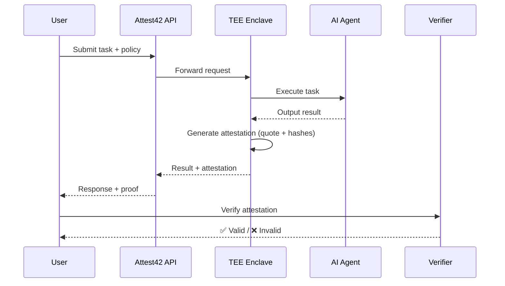

## 🧠 Attest42

> **Don’t trust AI agents. Verify them.**

Attest42 is a verification layer for AI agents running in Trusted Execution Environments (TEEs).
It generates **cryptographic attestations** proving that AI computations were executed correctly, privately, and according to defined policies.

---

## 🚀 Overview

AI agents are increasingly handling:

* private data
* credentials
* financial actions

But today, there is no way to **prove**:

* what they actually did
* whether they followed rules
* whether sensitive data was leaked

**Attest42 solves this.**

---

## 🔥 What Attest42 Does

Attest42 provides:

* ✅ **Execution Attestation**
  Proof that specific code ran inside a TEE

* 🔐 **Privacy Guarantees**
  Verifies no sensitive data was exposed

* 📜 **Policy Enforcement Proofs**
  Confirms constraints were respected

* 🧾 **Cryptographic Receipts**
  Signed, verifiable execution records

* 🔍 **Independent Verification**
  Anyone can verify results without trust

---

## 🧩 Core Concept

Attest42 introduces a simple but powerful flow:

```
Input → TEE Execution → Attestation → Verification
```

Instead of trusting AI outputs, users verify them.

---

## 🏗️ Architecture

### Components

1. **AI Agent**

   * Executes tasks (summarization, transformation, etc.)

2. **TEE Layer (Dstack / Mock)**

   * Secure execution environment
   * Generates remote attestation

3. **Policy Engine**

   * Defines allowed and forbidden behaviors

4. **Attestation Engine (Attest42)**

   * Produces verifiable proofs of execution

5. **Verification Layer**

   * Validates attestation, integrity, and compliance

---

## 🔄 Sequence Diagram



---

## 🧬 Attestation Model

Each execution produces a structured proof:

```json
{
  "agent_id": "agent-001",
  "input_hash": "0xabc...",
  "output_hash": "0xdef...",
  "policy": {
    "no_data_leakage": true,
    "allowed_actions": ["summarize"]
  },
  "tee_quote": "BASE64_ENCODED_QUOTE",
  "timestamp": 1710000000,
  "compliance": true,
  "signature": "BLS_SIGNATURE"
}
```

---

## 🛡️ Policy Examples

* ❌ Prevent raw input exposure
* ❌ Block external API calls
* ✅ Allow summarization only
* ✅ Restrict output format

---

## 🎬 Demo Scenario

### “Proving an AI agent didn’t leak secrets”

1. User submits private data
2. AI agent processes inside TEE
3. Malicious prompt attempts data extraction
4. Attest42 verifies:

   * no leakage
   * policy compliance
   * correct execution

---

## 🧱 Tech Stack

* **Backend**: Python, FastAPI
* **TEE**: Dstack (or simulated enclave)
* **Attestation**: DCAP / mocked quotes
* **Crypto**: BLS signatures (via PBTS patterns)
* **Frontend**: React + Vite
* **Storage (optional)**: IPFS / Filecoin

---

## 📁 Project Structure

```
attest42/
│
├── backend/
│   ├── app/
│   │   ├── main.py                 # FastAPI entrypoint
│   │   ├── api/
│   │   │   ├── routes.py          # REST endpoints
│   │   │   └── verify.py          # Verification endpoint
│   │   │
│   │   ├── core/
│   │   │   ├── config.py          # App config
│   │   │   ├── security.py        # Signing / hashing
│   │   │   └── policies.py        # Policy engine
│   │   │
│   │   ├── services/
│   │   │   ├── agent.py           # AI agent execution
│   │   │   ├── tee.py             # TEE interface (mock/dstack)
│   │   │   ├── attestation.py     # Attestation generator
│   │   │   └── receipts.py        # Cryptographic receipts
│   │   │
│   │   ├── models/
│   │   │   ├── request.py         # Input schema
│   │   │   ├── response.py        # Output schema
│   │   │   └── attestation.py     # Attestation schema
│   │   │
│   │   └── utils/
│   │       ├── hashing.py
│   │       └── encoding.py
│   │
│   ├── tests/
│   │   ├── test_agent.py
│   │   ├── test_attestation.py
│   │   └── test_verification.py
│   │
│   └── requirements.txt
│
├── frontend/
│   ├── src/
│   │   ├── App.tsx                # Main UI
│   │   ├── components/
│   │   │   ├── InputForm.tsx
│   │   │   ├── ResultCard.tsx
│   │   │   └── VerificationPanel.tsx
│   │   │
│   │   ├── services/
│   │   │   └── api.ts             # API calls
│   │   │
│   │   └── styles/
│   │       └── main.css
│   │
│   └── package.json
│
├── tee/
│   ├── enclave_simulator.py       # Mock TEE execution
│   ├── dstack_integration.py      # Optional real TEE
│   └── quote_verification.py      # Attestation verification
│
├── contracts/ (optional)
│   ├── AttestationRegistry.sol
│   └── deploy.js
│
├── scripts/
│   ├── run_demo.sh
│   └── generate_attestation.py
│
├── docs/
│   ├── architecture.md
│   └── threat_model.md
│
├── .env.example
├── docker-compose.yml
├── Dockerfile
└── README.md
```

---

## ⚙️ Quick Start

### 1. Backend

```bash
cd backend
pip install -r requirements.txt
uvicorn app.main:app --reload
```

---

### 2. Frontend

```bash
cd frontend
npm install
npm run dev
```

---

### 3. Run Demo

```bash
bash scripts/run_demo.sh
```

---

## 🔍 Verification Flow

```bash
POST /verify
```

Returns:

```json
{
  "valid": true,
  "checks": {
    "signature": true,
    "tee_quote": true,
    "policy_compliance": true
  }
}
```

---

## 🧠 Inspiration

* TEE-based systems (Dstack)
* Cryptographic receipts (PBTS)
* Semi-proprietary modules (verifiable execution)

---

## 🚀 Future Work

* On-chain attestation registry
* Integration with Quartz (smart contract verification)
* Policy marketplaces
* Multi-agent verification

---

## ⚠️ Disclaimer

This is a prototype built for experimentation and research.
TEE integrations may be simulated for demonstration purposes.

---

## 🏆 Why This Matters

> TEEs give you privacy.
> Attest42 gives you proof.